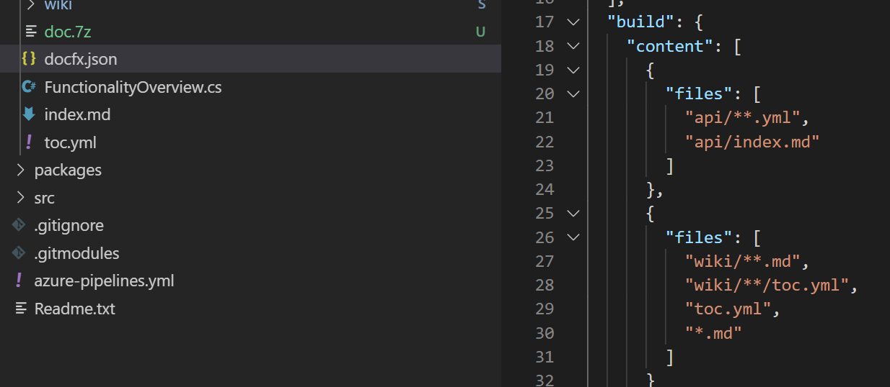
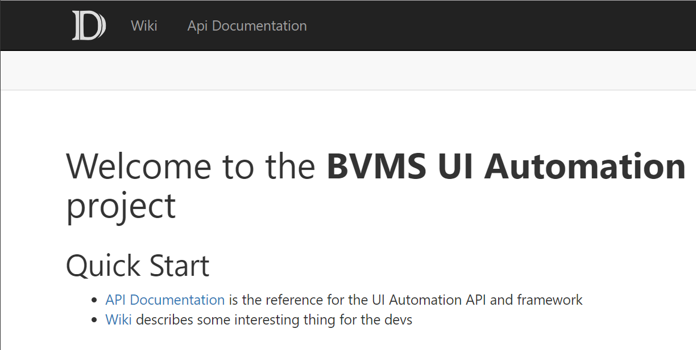
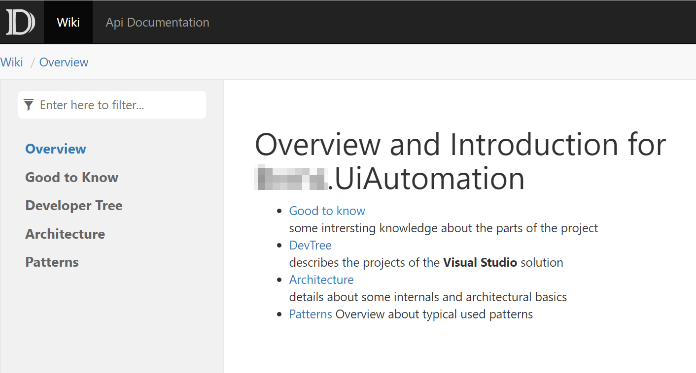
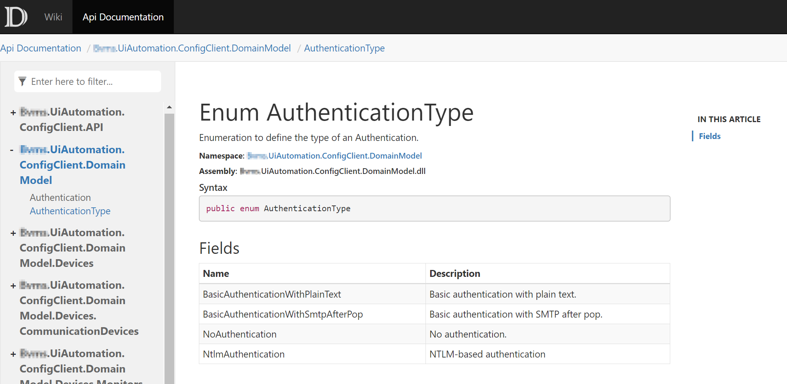
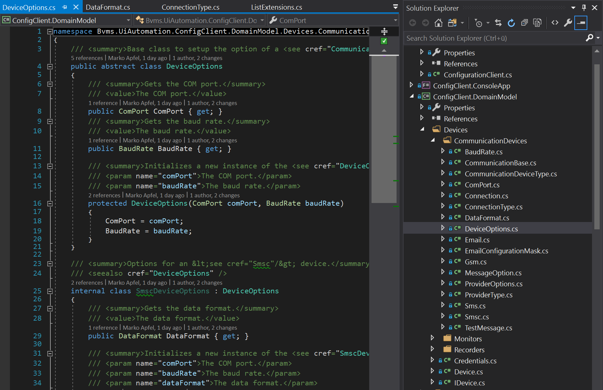
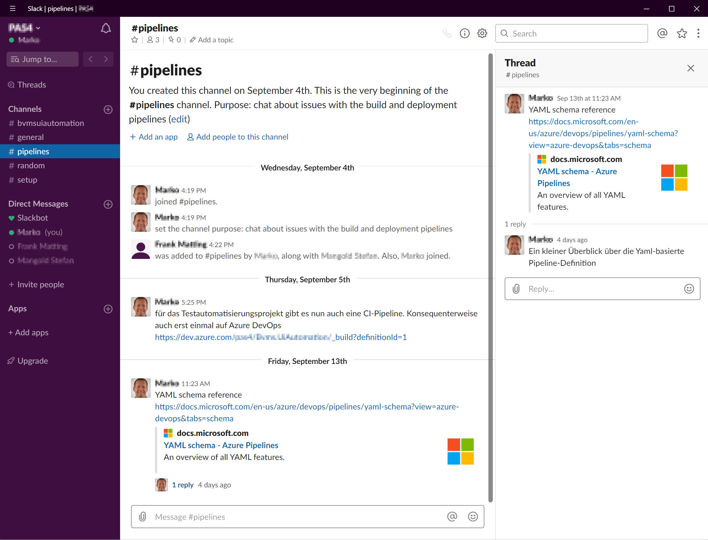
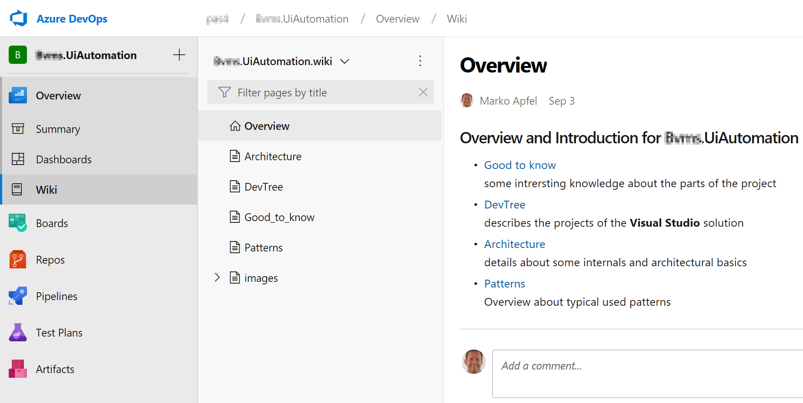
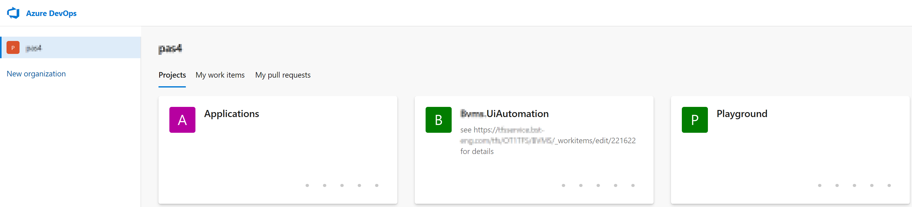
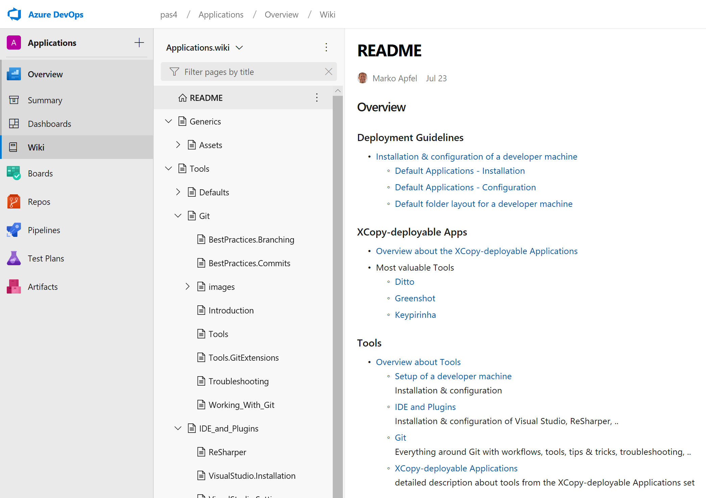

- title : Efforts-Tracking
- description : Tracking of the efforts
- author : Marko Apfel
- theme : night
- transition : default

***

## Efforts and Tracking

### How to use this Slide

- see right-down navigation hints
- use ⬅ and ⮕ to navigate between main topics
- use ⬆ and ⬇ to navigate between sub topics
- use `ESC` to see the slide-map

***
- id : Organizational

## Organizational and other topics

- ToDos and open tasks
- Annoying things

---

### ToDos and open tasks

- How to spread knowledge about XCopy-deployable tools?
- Road ahead and decicion about future of VCS?
    - Transition to Git
    - Recommendation for new projects/repos
- Road ahead with Wiki?

---

### Annoying things

- not for the public
- see OneNote "Annoying Things"

***
- id : NewTools

## New tools

- FsReveal
- DocFX
- Slack

***

### Introduced FsReveal

- to provide fancy presentations
- neutralized the tWiki presentation from the past
- started to host that version at  
  [http://mapfel.github.io/wiki-presentation](http://mapfel.github.io/wiki-presentation)
- which is the same as  
  [http://blog.apfel.space/wiki-presentation/](http://blog.apfel.space/wiki-presentation/)
- it can be used as the template for company specific presentations
- redirecting of the sub domain was made in the past  
  → have to figure out how 

***
- id : DocFx.2019-09

### DocFX

- Microsoft developed documentation tool
- open source successor of SHFB
- allows easily mix code documentation with additional content  
  (e.g. XML Comments, API documentation (OAS), tutorials,...)
- great support for .NET Core projects

---

#### Mix XML Comment with Wiki

- currently the XML Comments are merged together with Wiki content
- it is done inside the `docfx.json` file

---

#### Host the DocFX output via GitHub Pages

- used the `apm1grb` account to host the **DocFX** output 
- you can find here: [https://apm1grb.github.io/](https://apm1grb.github.io/)
- technically the content of the `_site` folder was included in an own repo

 

---

#### Wiki part of the documentation

 

---

#### Code/API/SDK part of the documentation

 

---

#### Use Git Submodules to link source code together with Wiki content and DocFX pimped source code XML Comments

- realized as sub modules
- checkout of the Wiki repo below `doc` folder 
- checkout of "`_site`-repo" below `doc` folder 
- needs awareness about workflows  
  (when the pull Wiki and to push "`_site`-repo")

---

#### Provide complete XML Comments

- completely documented all public and protected interfaces
- re-introduced GhostDoc in toolset

---

### Slack

- cloud-based set of team collaboration software tools and online services
- Slack = "Searchable Log of All Conversation and Knowledge."
- Most famous platform

---

- created a workspace, prepared some channels
- invited SM, FM

---

#### Contact with colleagues in AC

- alternative platform: **Mattermost**
- on-prem possible & open source
- not really adopted there

#### Road Ahead with O365

- under investigation, no rollout schedule
- Teams as the successor of Skpye would be a perfect alternative

***
- id : Wiki.2019-09

## BVMS UI Automation Wiki

- started to create a project Wiki
- based on Azure DevOps (Git & Markdown)
- capture knowledge about the BVMS UI Automation
- provide SMM, SDS,...

---

### Start with some basic knowledge

***
- id : EvaluationUiAutomation.2019-07

## Evaluate UI Automation Frameworks

***
- id : TechTalk.2019-07

## Tech Talk JUL 2019

- Azure DevOps
- Technical Wiki
- XCopy-deployable Apps

---

### Azure DevOps

- SSO with Bosch BCN Account
- Awareness-Creation/Knowledge-Transfer in ENG-teams
- Creation of an organization as a playground
    - incl. groups and members for/of ENG-teams

---

### Technical Wiki

- SharePoint Wiki is not a Wiki
- a lot of limitations
    - no real history for easily scanning for changes
    - no offline capabilities
    - bundling belonging things into "atomic" commits not possible
    - allows too much individual formatting
    - ?: What about versioning?
        - With conflict management?
        - With diffing?
    - ?: no commit message?

---

### Start with content

- Prepared a show case for a [tWiki](https://dev.azure.com/pas4/Applications/_wiki/wikis/Applications.wiki?pagePath=%2FREADME)
- XCopy-deployable Apps
    - Deployment Guidelines
    - Details about some tools
- IDE and Plgins
    - Visual Studio IG
    - ReSharper
- Git
    - Introduction
    - Workflows
    - Best Practices: Branching
    - Best Practices: Commits
    - Troubleshooting

---

