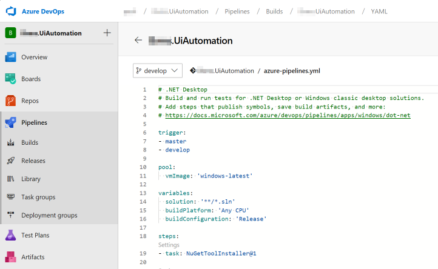
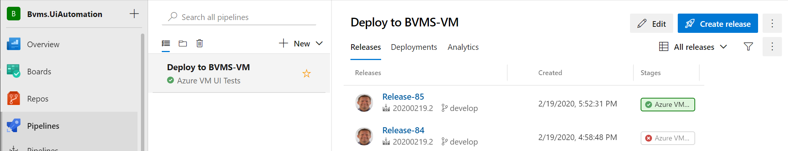
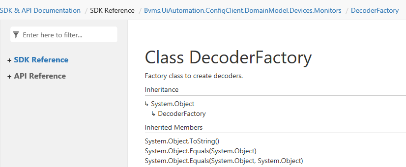
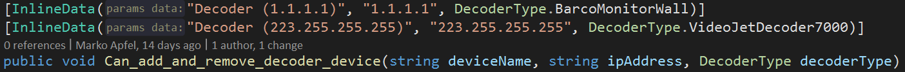

- title : Efforts-Tracking
- description : Tracking of the efforts
- author : Marko Apfel
- theme : night
- transition : default


***

## Efforts and Tracking

### How to use this Slide

- see right-down navigation hints  
  (yellow triangles show which navigation direction is possible)
- Navigation between topics with arrow keys
    - use ⬅ and ➡ to navigate between main topics
    - use ⬆ and ⬇ to navigate between sub topics
- other keys
    - use `Space` to present in order
    - use `ESC` to see the slide-map
    - use `f` for full screen

' find unicode arrows [here](http://xahlee.info/comp/unicode_arrows.html)

---

## Table of contents

- Organizational
- Techniques & Frameworks
- New Tools
- DocFX
- BVMS UI Automation Wiki
- Evaluate UI Automation Frameworks
- Tech Talk JUL 2019

***
- id : Organizational

## Organizational and other topics

- ToDos and open tasks
- Annoying things

---

### ToDos and open tasks

- How to spread knowledge about XCopy-deployable tools?
- Road ahead and decision about future of VCS?
    - Transition to Git
    - Recommendation for new projects/repos
- Road ahead with Wiki?

---

### Annoying things

- not for the public
- see OneNote "Annoying Things"

***
- id : Techniques-Frameworks

## Techniques & Frameworks

- Presentations about Dependency/Package Management
- **Paket**
- **PostSharp**

---

### PostSharp

- get rid of primitive obsessions  
  e.g. `int` datatypes with shrinked value range

```cs
[Range(1, 7)]
public int SanityCheckPeriod { get; internal set; }
// sanity check allows only values between 1 and 7
```

---

### Dependency/Package Management

- presentations for Architecture Group

  - [NuGet](http://bit.ly/ma-nuget)
  - [Paket](http://bit.ly/ma-paket)

- migrated from **NuGet** to **Paket**


***
- id : NewTools

## New tools, techniques

- **Slack**: seamless and productive messaging and co-working
- **FsReveal**: fancy presentations with versioning for devs
- **DocFX**: documentation
- **Git**: versioning
- **Markdown**: productive markup language for Wikis and other documentations
- **Azure DevOps**: ALM platform with Wiki, pipelines, ... 

---

### Slack

- cloud-based set of team collaboration software tools and online services
- Slack = "Searchable Log of All Conversation and Knowledge."
- Most famous platform

---

#### Status Quo

- created a workspace, prepared some channels
- invited SM, FM


---

### Alternatives

<br/>
<br/>

#### Contact with colleagues in AC

- alternative platform: **Mattermost**
- on-prem possible & open source
- not really adopted there

<br/>
<br/>

#### Road Ahead with O365

- under investigation, official rollout?; not accessible from E-Net
- Teams as the successor of Skpye would be a perfect alternative

---

### Introduced FsReveal

- to provide fancy web-based presentations
- neutralized the tWiki presentation from the past
- started to host that version at  
  [http://mapfel.github.io/wiki-presentation](http://mapfel.github.io/wiki-presentation)
- which is the same as  
  [http://blog.apfel.space/wiki-presentation/](http://blog.apfel.space/wiki-presentation/)
- it can be used as the template for company specific presentations
- redirecting of the sub domain was made in the past  
  → have to figure out how 

> [Homepage FsReveal](http://fsprojects.github.io/FsReveal/)

---

### DocFX

> see dedicated main topic [DocFX](#/DocFx.2019-09)

---

### Azure DevOps YAML Build Pipelines


> see dedicated main topic [Azure DevOps](#/AzureDevops.2020-02)


***
- id : AzureDevops.2020-02

## Azure DevOps

- successor/evolution of Visual Studio Team Services
- Repositories, Pipelines, Artifacts, Boards, Test Management
- Cloud and on-premises

---

### Virtual Infrastructure

- step into the VS Enterprise benefits
- BVMS provisioning for a VMs

---

### Build Pipeline based on yaml

- created `yaml`-based build pipeline
- pipeline as code, infrastructure as code



---

### Release Pipeline (destination: VM)

- installation & configuration of test agents
- deploy BVMS UI Automation assets
- run the UI tests in interactive mode
- --> gives devs more freedom




***
- id : DocFx.2019-09

## DocFX

- Microsoft developed documentation tool
- open source successor of SHFB for multiple platforms
- allows easily mix code documentation with additional content  
  (e.g. XML Comments, API documentation (OAS), tutorials, concepts,...)
- great support for .NET Core projects

> [Homepage DocFX](https://dotnet.github.io/docfx/)

---

### Mix XML Comment with Wiki

- currently the XML Comments are merged together with Wiki content
- it is done inside the `docfx.json` file


---

### Host the DocFX output via GitHub Pages

- used the `apm1grb` account to host the **DocFX** output 
- you can find here: [https://apm1grb.github.io/](https://apm1grb.github.io/)
- technically the content of the `_site` folder was included in an own repo

</br>


---

### Wiki part of the documentation

</br>


---

### Code/API/SDK part of the documentation

</br>


---

### Improvement: Split into SDK & API Documentation and aggregate topics

</br>



---

### Usage of Git Submodules 

- ties repository of source code (with its XML Comments) together with belonging repositories:
    - Wiki content
    - DocFX generated comprehensive documentation  
      (as static web sites to host on [GitHub Pages](https://apm1grb.github.io) or Azure WebSites)
- needs awareness about workflows  
  (when to pull Wiki and to push "`_site`-repo" (GitHub Pages))

---

### Command examples

- checkout of the Wiki repo below `doc` folder

        git submodule add 
          git@ssh.dev.azure.com:v3/<organization>/<project>/<repository>.wiki doc/wiki

- checkout of "`_site`-repo" below `doc` folder

        git submodule add
          git@<alias>:<username>/<username>.github.io.git doc/_site

- cloning with all submodules

        git clone 
          git@ssh.dev.azure.com:v3/<organization>/<project>/<repository> --recursive

---

### Provide complete XML Comments

- completely documented all public and protected interfaces
- re-introduced GhostDoc in toolset


***
- id : Libs.2019-08

## (Additionally) Evaluated Libraries, Frameworks, Techniques

- Unit-Testing: xUnit, FluentAssertitions, Shouldly
- Office Connectivity: F#, ExcelProvider
- Azure DevOps YAML Build Pipelines

---

### xUnit

- benefits of **xUnit** compared to **NUnit**
    - .NET Core "default" testing FW
    - felt to be more logical/intuitive and aligned with C# language  
      `ctor` vs. `[SetUp]` attribute
    - `InlineData` and `MemberData` to parametrize unit test?



> [What are the best unit testing frameworks for .NET?](https://www.slant.co/topics/543/versus/~xunit-net_vs_nunit_vs_mstest)

---

### FluentAssertion & Shouldly

- started with **Shouldly** (used in PluralSight course)
- switched later to **FluentAssertions** (seen as better alternative)


---

### F#, ExcelProvider

> Challenge:  
  "use Excel sheets to create a BVMS configuration"

- F# type provider for Excel
    - allows easiest access of sheet content
    - creates strongly-typed type out of the sheets data

</br>

```fsharp
let decodersSheet = "Decoders"
type DataTypesTest = ExcelFile< @"..\..\..\cfg\Configuration.xlsx", decodersSheet>
let CreateListOfDecoders fromFile =
    let file = new DataTypesTest(fromFile, decodersSheet)
    file.Data 
        |> Seq.map (fun row -> DecoderFactory.CreateDecoder 
            (row.Name, row.DecoderType, row.``IP-Adresse``)
```


***
- id : Wiki.2019-09

## BVMS UI Automation Wiki

- started to create a project Wiki
- based on Azure DevOps (Git & Markdown)
- capture knowledge about the BVMS UI Automation
- provide SMM, SDS,...

---

### Start with some basic knowledge


***
- id : EvaluationUiAutomation.2019-07

## Evaluate UI Automation Frameworks

- Coded UI
- TestStack White
- Appium
- FlaUI

---

### Coded UI

- deprecated (VS 2019 is the last supporting version)  
  see: [Changes to Coded UI Test in Visual Studio 2019](https://devblogs.microsoft.com/devops/changes-to-coded-ui-test-in-visual-studio-2019/)
- too chatty by recording  
  → difficult to maintain
- toolset might be allow to capture details which other tools not able to do

---

### TestStack White

- abandoned (last commit in MAR 2017)
- maybe one of the 500 forks is still under development?
    - half a dozend have newer commits
    - but first look doesn't show benefit  
      e.g. add Azure build capabilities
- mix of UIA 2 (base for White) and 3 (sloppily added)
    - UIA 2: has limited capabilities  (e.g. Spinner)
    - UAI 3: currently maintained by MS

---

### Appium

- recommended from MS to use for Desktop App testing
- not possible to get it properly to run
- uses a web based host for interaction with user

---

### FlaUI

- based on ideas of **TestStack White**
- under maintenance, 12 contributors
- acceptable documentation, blog
- more concise and handy compared to **TestStack White**  
  nevertheless very similar regarding architecuture, principles,...

> We use that for further steps.


***
- id : TechTalk.2019-07

## Tech Talk JUL 2019

- Azure DevOps
- Technical Wiki
- XCopy-deployable Apps

---

### Azure DevOps

- SSO with Bosch BCN Account
- Awareness-Creation/Knowledge-Transfer in ENG-teams
- Creation of an organization as a playground
    - incl. groups and members for/of ENG-teams


---

### Technical Wiki

- SharePoint Wiki is not a Wiki
- a lot of limitations
    - no real history for easily scanning for changes
    - no offline capabilities
    - bundling belonging things into "atomic" commits not possible
    - allows too much individual formatting
    - ?: What about versioning?
        - With conflict management?
        - With diffing?
    - ?: no commit message?

> [Wiki-Presentation](http://mapfel.github.io/wiki-presentation)

---

### Start with content

- Prepared a show case for a [tWiki](https://dev.azure.com/pas4/Applications/_wiki/wikis/Applications.wiki?pagePath=%2FREADME)
- XCopy-deployable Apps
    - Deployment Guidelines
    - Details about some tools
- IDE and Plgins
    - Visual Studio IG
    - ReSharper
- Git
    - Introduction
    - Workflows
    - Best Practices: Branching
    - Best Practices: Commits
    - Troubleshooting

---


***


